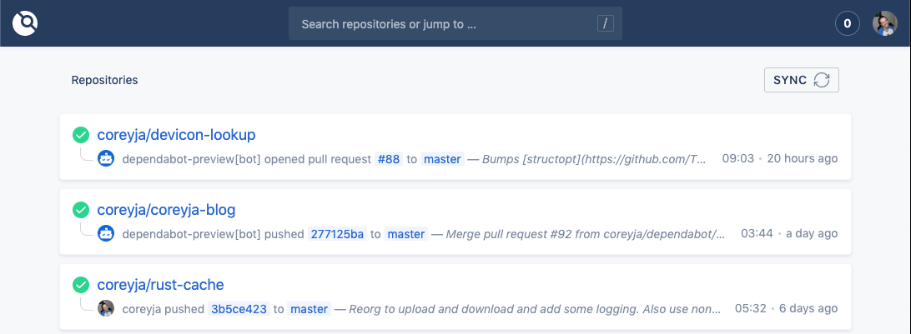

This is Part 1 of a multiple part series diving into using Drone as a CI platform!
Here is a rough outline of what these series might look like. This is liable to change until each post is released!

- Part 1: Self Hosting a Drone CI Instance (This post)
- Part 2: Running tests on Drone CI and writing a basic `.drone.yml` file
- Part 3: Advanced `.drone.yml` techniques
- Part 4: Caching Dependencies on S3

# Self Hosting a Drone CI Instance

I love continuous integration and have CI setup on most of my personal projects, even if it just runs some linters.

I previously was using [CircleCI](https://circleci.com/) almost exclusively. They provide a great service, that is free for a decent bit of personal use. In this case 'a decent bit' of personal use is 1000 minutes a month for free. This is just under 17 hours, at 16.666.

However there were a few months were I was hitting up against that free limit and that led to my builds getting queued and slowed. So I started looking at my options. CircleCI offers paid plans so first I looked there, but unfortunately their first paid offering started at \$50 a month. [1] This offering seems more geared towards businesses, not personal developers so I kept exploring my options.

[1] At the time of writing it is actually $90 now, but they have a $23 plan coming soon https://circleci.com/pricing/usage/

I've also been on a self hosting kick, and I recently rented a relatively big server in the cloud that was going mostly unused, so it was a perfect storm to look for self hosted CI options!

The option that I ended up with is [Drone](https://drone.io/). I've been running my instance for a few months, and have recently migrated most (but not all) of my projects over from CircleCI.

## Installing Drone

I already have `Dokku` running on my server (see my previous post about [migrating to Dokku here](https://coreyja.com/migrating-from-heroku-to-dokku/)), so I wanted to use that to install and manage Drone if possible. Luckily both of these are built on top of Docker, and so far have worked pretty well together. Already having a Dokku server up and running definitely gave me a head start in getting Drone running!

I created this pretty boring repo to help manage deploying with Dokku (https://github.com/coreyja/drone-dokku). Basically this is just a simple repo that contain a single Dockerfile. This inherits from the official Drone image, and exposes the correct port. Now I can push this repo to Dokku, for it to manage my installation and networking for me.

Drone does rely on a few mounted volumes in Docker that I also had to configure in Dokku that was accomplished with the following commands

```bash
dokku storage:add drone /var/run/docker.sock:/var/run/docker.sock
dokku storage:add drone /var/lib/drone:/data
```

I am looking to potentially move this installation onto Kubernetes sometime soon and if I do I will make a follow post describing that.

## Configuring Drone

Setting up Drone was also relatively painless thanks to their Documentation (https://docs.drone.io/installation/github/single-machine/). This is the docs for a single instance machine, like I am running with Dokku, and using Github as the repo source. Drone also supports GitLab, Gitea, Gogs and Bitbucket.

Once I created the correct Github credentials, I grabbed the two I needed and added them as the following ENV vars available to Drone: `DRONE_GITHUB_CLIENT_ID`, `DRONE_GITHUB_CLIENT_SECRET`.

Then there are only 2 other ENV vars that are required: `DRONE_SERVER_HOST` and `DRONE_SERVER_PROTO` where the host name and protocol go.
For instance here are my config for those two variables:

```bash
DRONER_SERVER_HOST=drone.dokku.coreyja.com
DRONE_SERVER_PROTO=https
```

I also have `DRONE_RUNNER_CAPACITY=4`, which means I can have 4 containers running in parallel.

As far as config goes this is all you need to get the app running 🎉

## Booting the App and Logging In

Now we should be able to boot up and login to our self-hosted Drone instance!

Drone does not have any authentication of its own and relies entirely on OAuth from Github. I love this model cause it’s one less account to have to manage.

This means that the first thing you will have to do is login to Drone via Github and give it access to your repositories. After this you can use the Web UI to add specific projects to Drone!

Once you have a project added Drone will register for web-hooks with Github and kick off builds whenever there are pushes to your Github repo.

That is of course if you have a `.drone.yml` file setup in your repo.
Which, luckily, its gonna be the next post in this series! 😉
