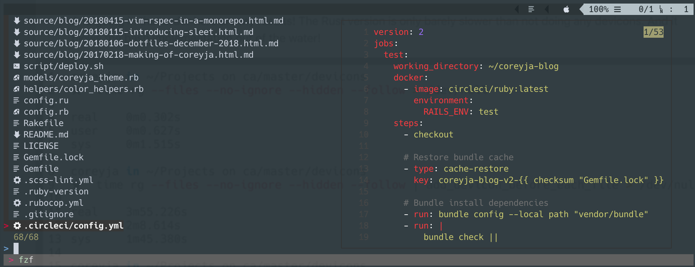

[](./example-screenshot.png)

## Background

When I wrote my last blog post [VIM Spelling Suggestions with fzf](/blog/2018/11/10/vim-spelling-suggestions-fzf.html) I got a couple comments on [dev.to](https://dev.to)! One of them was from [@maxdevjs](https://dev.to/maxdevjs), we exchanged a few comments and I found [`vim-devicons`](https://github.com/ryanoasis/vim-devicons) in his dotfiles! It worked out of the box with both nerdtree and airline and I really enjoyed it! @maxdevjs also had a link to this [Github Issue](https://github.com/ryanoasis/vim-devicons/issues/106) which was about how people were able to add fzf support. I was on an fzf kick so that got me interested!

## Original Solution

This Github Issue actually already had a really functional solution! Here is the comment that I used as my base for this, [https://github.com/ryanoasis/vim-devicons/issues/106#issuecomment-354629715](https://github.com/ryanoasis/vim-devicons/issues/106#issuecomment-354629715)

Here is the source code from that comment:

```vimscript
" Files + devicons
function! Fzf_dev()
  let l:fzf_files_options = '--preview "rougify {2..-1} | head -'.&lines.'"'

  function! s:files()
    let l:files = split(system($FZF_DEFAULT_COMMAND), '\n')
    return s:prepend_icon(l:files)
  endfunction

  function! s:prepend_icon(candidates)
    let l:result = []
    for l:candidate in a:candidates
      let l:filename = fnamemodify(l:candidate, ':p:t')
      let l:icon = WebDevIconsGetFileTypeSymbol(l:filename, isdirectory(l:filename))
      call add(l:result, printf('%s %s', l:icon, l:candidate))
    endfor

    return l:result
  endfunction

  function! s:edit_file(item)
    let l:pos = stridx(a:item, ' ')
    let l:file_path = a:item[pos+1:-1]
    execute 'silent e' l:file_path
  endfunction

  call fzf#run({
        \ 'source': <sid>files(),
        \ 'sink':   function('s:edit_file'),
        \ 'options': '-m ' . l:fzf_files_options,
        \ 'down':    '40%' })
endfunction
```

This does three basic things:

1. Uses the `rouge` gem to create a syntax highlighted preview within fzf
2. Prepends the devicon to each line generated by the `$FZF_DEFAULT_COMMAND` and uses that as the `fzf` source
3. Sets the `sink` so that when you select an option the devicon is stripped out and you edit the intended file

When I copied this to my dotfiles and played around with it I had a few things I wanted to improve on!

## Preview

The original solution used `rogue` to create syntax highlighted previews. I really liked having the previews, but felt the rogue rendering took too long. For my use of fzf, its all about speed, so having the rendering lag behind what option I had selected was noticeable and annoying.
Recently I (re)discovered [`bat`](https://github.com/sharkdp/bat), which is a `cat` replacement, and also includes syntax highlighting!

So the first thing I did was replace `rougify` with `bat` and had a line like the following

```vimscript
let l:fzf_files_options = '--preview "bat {2..-1} | head -'.&lines.'"'
```

This worked! And I was getting near instantaneous results :tada:. Unfortunately it wasn't syntax highlighted. I realized this was due to the fact that `bat` tries to be compatible with `cat` and if it detects you are piping the output (like was happening in the preview) it defaults to acting like a `cat` clone. Luckily fixing this was as easy as passing an option to `bat`, `--color always` did the trick! `bat` also includes line numbers and a header by default. I liked the line numbers, but didn't like the header so I hid it by explicitly saying I only wanted the line number with `--style numbers`. Now my preview line looks like the following:

```vimscript
let l:fzf_files_options = '--preview "bat --color always --style numbers {2..} | head -'.&lines.'"'
```

After this I was really happy with the previews that fzf was providing

## Prepending the Devicons

One thing that I really enjoy about fzf is that it is a streaming fuzzy finder, which means that you can start fuzzy finding even before it has received all the input. This is important to me, because I have my default fzf command (`$FZF_DEFAULT_COMMAND`) set to the following, which includes most hidden files and respects symlinks. As such I often have tens of thousands of results in a typical rails project, with a node_modules directory.

```bash
rg --files --no-ignore --hidden --follow --glob "!.git/*"
```

When I first started testing out these solutions I was doing it sample directories that only had a limited numbed of files. In those directories I didn't notice any slowdown when adding the devicons. But when I moved to some of my actual project directories I realized that fzf would open empty, before populating all the results at once. Again, this delay was annoying me and I was in the mood to optimize!

## Streaming Bash

I knew from working with fzf in VIM recently that it accepted a few types of things for its source. The two big ones are a VIM list, or a string indiciating a shell command to call. In the original solution, we were taking the fzf default command and executing it with `system` in vim. This meant we would take the entire output of the fzf default command, and take it into vim to be processed. We then split it on newlines to get a vim list. We loop through each filename in the list, and prepend the correct devicon. Then we pass this list to `fzf` to be the source.
This works perfectly well, but this is where the lag I noticed was coming from. Before fzf was able to show me any results, the fzf command would have to completely finish, THEN the filenames would have to be prepended with the devicons and finally fzf could render the list. This meant that fzf was no longer able to 'stream', and had to wait for all the input to be ready before it could start displaying results.

`fzf` uses streaming by default if you use a bash command as a string for the fzf source. So I realized that to enable streaming again, the solution might have to be outside of VIM. Since the input is a bash command, BASH came to mind as the obvious first choice and I worked on a proof of concept! The basic idea was that I would have a script that would take in lines via STDIN, and prepend the correct devicon to each one. It would then output each line as it was processed to STDOUT. This way it would 'stream' out the new lines, with the prepended devicons.

I thought I should look quick to make sure someone hadn't already done this and came across [ryanoasis/devicons-shell](https://github.com/ryanoasis/devicons-shell) which is by the same person as the [`vim-devicons`](https://github.com/ryanoasis/vim-devicons) plugin! It didn't do exactly what I wanted but it was pretty close. I took most of it to write my inital prototype, which ended up looking like the following:

```bash
function devicons_get_filetype_symbol {
  declare -A extensions=(
    [ai]=
    ... (Shortened for brevity)
    [zsh]=
  )

  local folder=""
  local filetype
  local default=
  local exist_check=1
  local input=$1
  local filename="$1"
  # using ## for possibly more than one "." (get after last one):
  local filetype="${filename##*.}"

  if [ -d "$filename" ]; then
    local symbol=$folder
  elif [ ! -z "$filetype" ] && [ ${extensions[$filetype]+$exist_check} ]; then
    local symbol=${extensions[$filetype]}
  else
    local symbol=$default
  fi
  echo "$symbol"
  return 0
}

while IFS= read -r line; do
  echo -e "$(devicons_get_filetype_symbol $line) $line"
done
```

I tested this out with `ls | ./protype_script` and was really pleased with the results! Now just had to integrate it into VIM, which turned out to be pretty easy and we actually got to remove some of the `.vimrc` code!

Now we get to take advantage of fzf streaming, and as such are passing a String as the source for fzf. We simply pipe the results of the default command, into our new script. This allows us to delete both `files` and the `prepend_icon` functions, since we replaced their functionality with our script.

```vimscript
call fzf#run({
    \ 'source': $FZF_DEFAULT_COMMAND.' | prototype_script',
    \ 'sink':   function('s:edit_devicon_prepended_file'),
    \ 'options': '-m ' . l:fzf_files_options,
    \ 'down':    '40%' })
```

I tried this out in my small sample directories and it seemed to be working great! Moved onto my bigger directories and everything was looking good! I could see that results were streaming in, as the total number of results in fzf kept rising but I was still able to use it in the meantime!

After a few minutes of day to day jumping between files I realized that sometimes I would search for a file that hadn't been added to fzf yet, and I would have a delay before the result I wanted appeared. This was something I didn't experience before adding devicons, so I suspected that to be the issue. I did a side by side comparison with the stock `:Files` command and the results were clear. The default completed orders of magnitude faster. I could see the fzf totals load, but it was in fractions of seconds. With my bash solution it took tens of seconds to load all my files. There was room for improvement!

## Rust Implementation

I have almost no experience with Rust, but its been a language I've been interested in for awhile. Coincidentally `bat` is also written in Rust, and its speed for the preview part earlier gave me high hopes it would also help out here.

Being fairly new to Rust, my first step was to figure out how best to use a hash map of some sort for the extension to devicon mapping. One of the first things I stumbled upon was [`lazy_static`](https://github.com/rust-lang-nursery/lazy-static.rs), which appeared to do pretty much what I wanted. This was static at run-time, I was looking for something that was static at compile time, but from my very very quick glance it seemed Rust didn't support that easily [1], so static at runtime would be good enough!

```rust
lazy_static! {
  static ref SYMBOL_MAP: HashMap<&'static str, &'static str> = {
    let mut m = HashMap::new();
    m.insert("ai", "");
    ...
    m.insert("zsh", "");

    m
  };
}
```

After I got my HashMap setup, I needed to do the actual text streaming part. I found [this Stack Overflow answer](https://stackoverflow.com/a/30186553) which was 80% of the work! Here was their simple text streaming example

```rust
fn main() {
    let stdin = io::stdin();
    for line in stdin.lock().lines() {
        println!("{}", line.unwrap());
    }
}
```

Now I just needed to parse the extension and lookup the symbol in my HashMap. Again, the Rust standard libraries came in handy as parsing the extension was a one liner!

```rust
Path::new(filename).extension().and_then(OsStr::to_str)
```

Throw in a little Rust type magic and :tada:, the Rust version was ready to test out!

```rust
#[macro_use]
extern crate lazy_static;

use std::collections::HashMap;
use std::ffi::OsStr;
use std::io::{self, BufRead};
use std::path::Path;

static DEFAULT_SYMBOL: &str = & "";
lazy_static! {
  static ref SYMBOL_MAP: HashMap<&'static str, &'static str> = {
    let mut m = HashMap::new();
    m.insert("ai", "");
    ...
    m.insert("zsh", "");

    m
  };
}

fn get_extension_from_filename(filename: &str) -> Option<&str> {
  Path::new(filename)
    .extension()
    .and_then(OsStr::to_str)
}

fn main() {
  let stdin = io::stdin();
  for line in stdin.lock().lines() {
    let filename = line.unwrap();
    let extension = get_extension_from_filename(& filename);
    let symbol = match extension {
      Some(extension) => SYMBOL_MAP.get(& extension).unwrap_or(& DEFAULT_SYMBOL),
      None => DEFAULT_SYMBOL
    };
    println!("{} {}", symbol, filename);
  }
}
```

I plugged this new version into vim, by simply changing the source to pipe to my new Rust built binary, instead of the prototype bash script. And :drumroll:, it worked and was significantly faster than the bash version! It wasn't even noticeably slower than the default `:Files` command!

## Performance

Here is a very unscientific single trial test where I timed three different commands in a large directpry.

1. Using my defauly FZF command alone
2. Using it with the prototype bash implementation
3. Using it with my Rust implementation

And going in that order here are my results! The Rust version is only barely slower than not doing any devicons. And it blows the bash implementation out of the water!

```bash
coreyja in ~/Projects on ca/master/devicons
★  time rg --files --no-ignore --hidden --follow > /dev/null

real    0m0.302s
user    0m0.627s
sys     0m1.515s

coreyja in ~/Projects on ca/master/devicons
★  time rg --files --no-ignore --hidden --follow | add_devicon_before_each_file > /dev/null

real    3m55.226s
user    2m8.614s
sys     1m45.380s

coreyja in ~/Projects on ca/master/devicons
★  time rg --files --no-ignore --hidden --follow | devicon-lookup > /dev/null

real    0m0.409s
user    0m0.743s
sys     0m1.535s
```

For an even less scientific test, I took the original implementation and the final rust version, in VIM. Since I was doing the tests inside VIM, and am timing until a window appears, there wasn't an easy way to time this automatically. So I broke out my stopwatch for this one. Using my rust implementation `:call Fzf_files_with_dev_icons($FZF_DEFAULT_COMMAND)` the fzf window came up pretty much instantaneously, and all the results were already populated! With the original VIM implementation `:call Fzf_dev()` it took around 4.5 seconds for the window to load. And when it loaded it was fully populated with all the files.

This was a huge improvement, and the performance is now definitely acceptable for me and has been added to my dotfiles!

## Final Version

After I got this Rust version working, I also spent some time refactoring so that I could reuse the same function for searching only the files under git. This was as easy as extracting the function that was called to a parameter. The other thing I did was integrate the same devicons into the `:GFiles?` which only shows files that have changed in git. This deserves it's own blog post cause it took a bit of finagling!

And here we have it, my final (for now) fzf File Fuzzy Finding with Devicons Powered by Rust!

```vimscript
" Files + devicons
function! Fzf_files_with_dev_icons(command)
  let l:fzf_files_options = '--preview "bat --color always --style numbers {2..} | head -'.&lines.'"'
   function! s:edit_devicon_prepended_file(item)
    let l:file_path = a:item[4:-1]
    execute 'silent e' l:file_path
  endfunction
   call fzf#run({
        \ 'source': a:command.' | devicon-lookup',
        \ 'sink':   function('s:edit_devicon_prepended_file'),
        \ 'options': '-m ' . l:fzf_files_options,
        \ 'down':    '40%' })
endfunction
 function! Fzf_git_diff_files_with_dev_icons()
  let l:fzf_files_options = '--ansi --preview "sh -c \"(git diff --color=always -- {3..} | sed 1,4d; bat --color always --style numbers {3..}) | head -'.&lines.'\""'
   function! s:edit_devicon_prepended_file_diff(item)
    echom a:item
    let l:file_path = a:item[7:-1]
    echom l:file_path
    let l:first_diff_line_number = system("git diff -U0 ".l:file_path." | rg '^@@.*\+' -o | rg '[0-9]+' -o | head -1")
     execute 'silent e' l:file_path
    execute l:first_diff_line_number
  endfunction
   call fzf#run({
        \ 'source': 'git -c color.status=always status --short --untracked-files=all | devicon-lookup',
        \ 'sink':   function('s:edit_devicon_prepended_file_diff'),
        \ 'options': '-m ' . l:fzf_files_options,
        \ 'down':    '40%' })
endfunction
 " Open fzf Files " Open fzf Files
map <C-f> :call Fzf_files_with_dev_icons($FZF_DEFAULT_COMMAND)<CR> " :Files
map <C-d> :call Fzf_git_diff_files_with_dev_icons()<CR> " :GFiles?
map <C-g> :call Fzf_files_with_dev_icons("git ls-files \| uniq")<CR> " :GFiles
```

I also released the Rust code as a [crate](https://crates.io/crates/devicon-lookup) which you can install with

```bash
cargo install devicon-lookup
```

This will give you the `devicon-lookup` binary, that you can use in your VIM setup!

## Acknowledgments

As I get ready to publish this blog post I realized I didn't mention the [`fzf.vim`](https://github.com/junegunn/fzf.vim) plugin at all! This is what I refer to as the 'default' implementation, for the fzf :Files view and is am amazing plugin! I basically tried to copy this plugin as closely as possible, especially when trying to reimplement the `:GFiles?` support.

[^1]: After that fact I found and looked into [phf](https://github.com/sfackler/rust-phf) which DOES provide compile time static maps. It doesn't use the Rust HashMap, and instead implements it's own hashing functionality. Their implementation of hashing also differs from the Rust HashMap is ways that weren't meaningful for this project. I wanted to use stable Rust for this which meant I couldn't use `phf_macros` which has the much prettier syntax. Being on Stable rust meant I would be forced to use the codegen option, which requires a preliminary 'compile' step, where you run a build script which outputs a rust source file containing the hash code. This seemed like a lot of extra work, and according to [this blog](http://siciarz.net/24-days-rust-static-initialization/) the speed benefits of upgrading would have existed, but would not have been an order of magnitude increase, and I was already happy with the performance.


